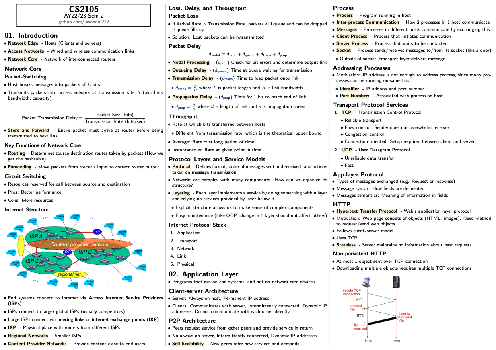
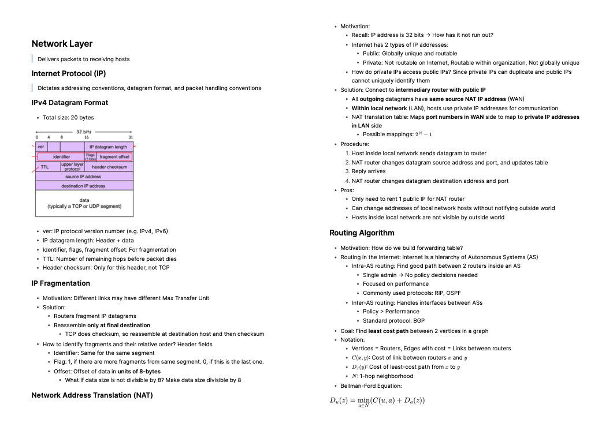

# CS2105 - Introduction to Computer Networks

_Taken in AY22/23 Semester 2_

    

<em>Part 1 - Covers application layer, transport layer, and some of network layer</em>

    

<em>Part 2 - Covers rest of network layer, link layer, network security, and multimedia networking</em>

## Summary of Internet Protocol Stack

1. Physical layer
2. Link layer: Sending between adjacent nodes (Including switches)
   - CRC: Error detection
   - TDMA/FDMA: Divide channels into smaller pieces, each dedicated to 1 node
   - ALOHA: Given random access, node resends frame in next slot with some probability until no more collisions
   - CSMA/CD: Listen before transmit
   - Switch forwarding
   - ARP: How to get MAC address from IP address?
3. Network layer: Communication between hosts (Including routers)
   - IP
   - CIDR: Method of hierarchically assigning IP addresses
   - NAT: Router maps port numbers in WAN to private IP addresses in LAN
   - ICMP: Error reporting
4. Transport layer: Communication between processes
   - UDP
     - RDT
     - Go-Back-N
     - Selective Repeat
   - TCP
     - RDT
5. Application layer:
   - HTTP: Protocol for sending/receiving web objects
     - Cookies
     - Web cache
   - DNS: Map IP address to domain
   - DHCP: Method for host to get its IP address
