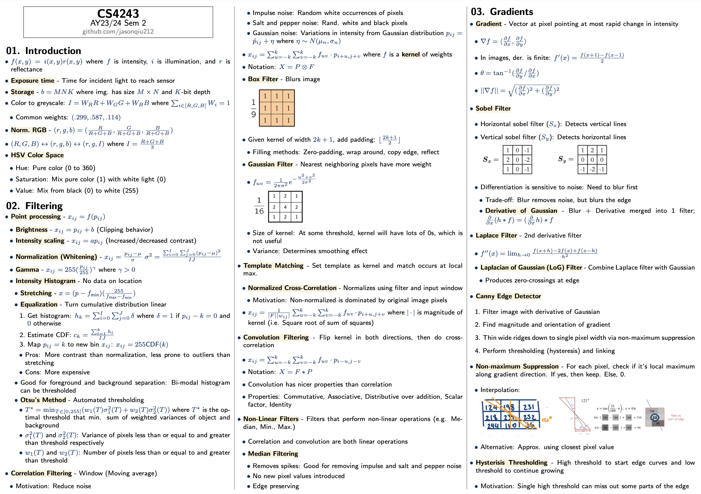
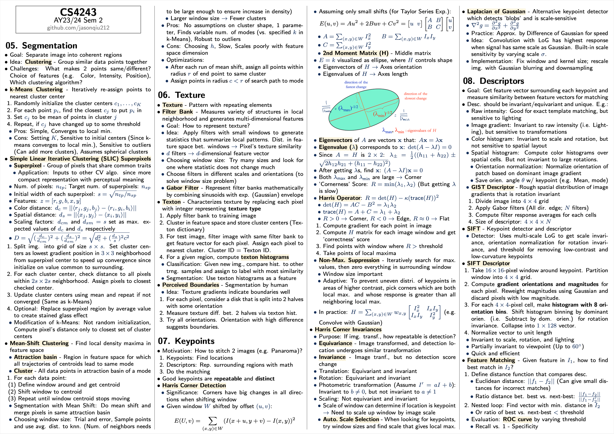

# CS4243 - Computer Vision and Pattern Recognition

_Taken in AY23/24 Semester 2_

<!-- ## Midterm Cheatsheet

- Covers introduction, filtering, gradients, lines, and segmentation

    

 -->

## Final Cheatsheet

- Covers segmentation, texture, keypoints, descriptors, homography, optical flow, tracking, and deep learning

    

